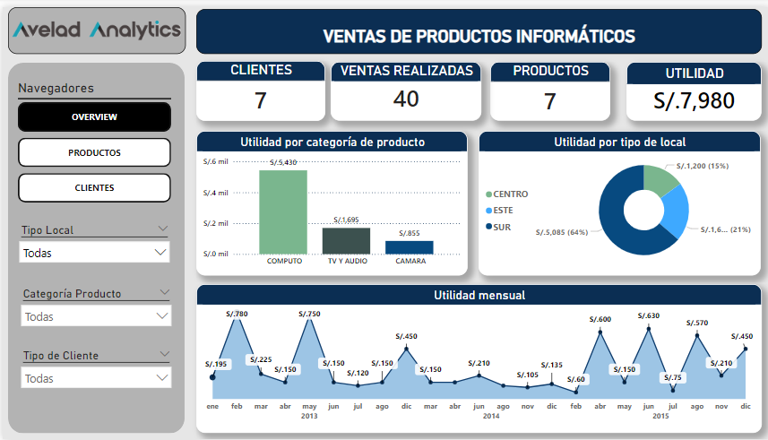
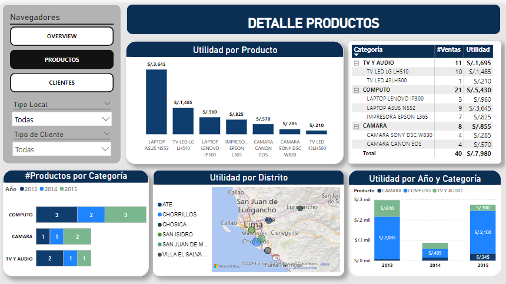

## Dashboard_VentasProductos
##### Link: https://app.powerbi.com/view?r=eyJrIjoiYmE5MDIwZjQtZmVlNy00NGVjLWFjNzctOTFmNWRlZTkxZjAyIiwidCI6IjFlYmE0NDNmLTIzZTUtNDUzNC05MGQxLTA5NzZhYWJlODZhYyIsImMiOjR9

Bienvenido a la carpeta del Dashboard de Venta de Productos Informaticos
### Pestaña 1: Overview

En la pestaña Overview tenemos una vision clara de los 4 indicadores que resumen un proceso de ventas en tres años, observamos graficos como las utilidades por sectores, tipos de productos y su evolucion a lo largo del tiempo.
Asimismo podemos ver que el rubro que genera mayores utilidades es el de 'Computo', el cual, tras una caida en el año 2014, logra recuperarse el año siguiente.

### Pestaña 2: Productos

La segunda pestaña está dedicada al análisis de nuestros Priductos. El detalle de productos revela que la "Laptop ASUS N552" es el producto más rentable, generando S/.3,645 en utilidades totales. Las categorías de "cómputo" y "TV y audio" representan la mayoría de las ventas, indicando una fuerte demanda en estas áreas. Además de ello, los clientes de los distritos de "San Isidro"  son los que mayor volumen de ventas generan, mientras que los clientes de "San Juan de Miraflores" son los que menor volumen nos generan. 

### Pestaña 3: Clientes

Finalmente, en cuanto a los clientes se destaca que los clientes frecuentes aportan el 60% de las utilidades totales, demostrando que es importante la fidelización de los clientes. Además, los clientes Masculinos generan mayores utilidades en comparación que las clientes femeninas, resultando casi el doble del total. 

Este análisis sugiere oportunidades para estrategias de marketing específicas que maximicen las ventas en segmentos de alto rendimiento y diversifiquen la base de clientes para un crecimiento.

### Modelado de Datos en Power BI

